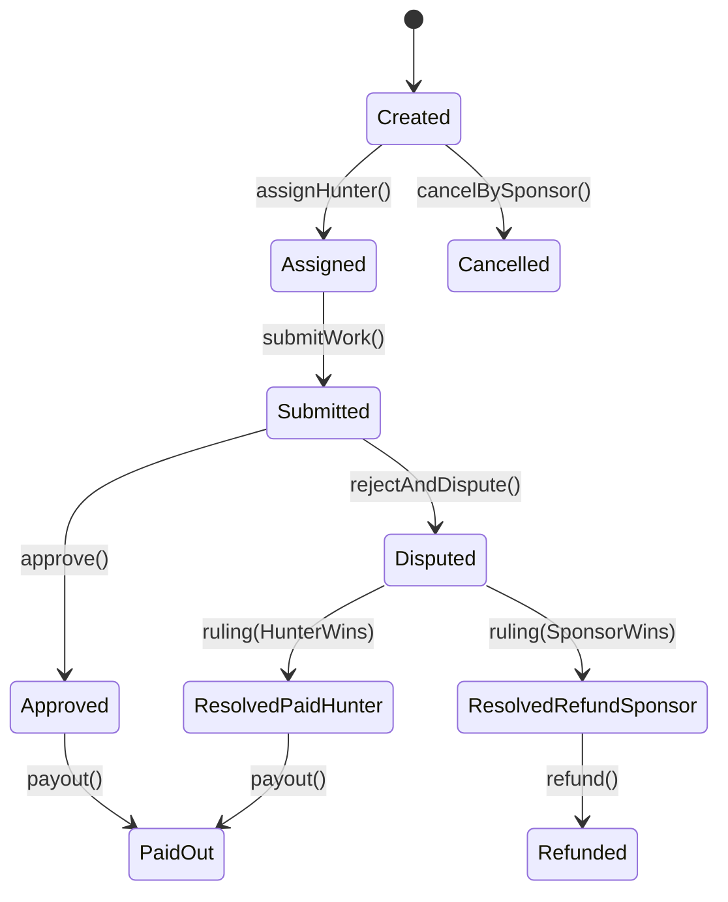

# Спецификация MVP: Bounty Marketplace

## Роли
- **Sponsor**: создает bounty и депонирует средства в escrow.
- **Hunter**: подает заявку и выполняет работу.
- **Arbitrator**: внешний арбитражный протокол (Kleros-like), который выносит `ruling` в случае спора.

## Источники истины
- **On-chain**: депозит, выбранный токен, суммы, критические статусы, спор/решение, выплата.
- **Off-chain**: поиск/фильтры/теги, расширенные метаданные, уведомления, inbox, профили.

## Состояния bounty (state machine)
Состояние хранится on-chain и индексируется off-chain.

### Инварианты
- **Депозит** создается только один раз и не меняется после `createBounty` (в MVP без top-up).
- **Оплата** происходит только из escrow, только один раз (идемпотентность).
- **Токены**: ETH или whitelisted ERC20.
- **Назначение исполнителя**: в MVP sponsor выбирает hunter из заявок.
- **Спор**: возможен только из `Submitted`.

## Метаданные bounty (off-chain JSON)
On-chain хранится `metadataURI` + `metadataHash` (keccak256 от bytes JSON или canonicalized JSON).
Схема: `packages/shared/src/metadata/bounty.schema.json`.

### Минимальные поля (MVP)
- `title`: string
- `description`: string (markdown)
- `category`: enum (bugfix/feature/audit/design/content/other)
- `tags`: string[]
- `difficulty`: enum (easy/medium/hard)
- `payout`: { `tokenSymbol`: string, `amount`: string } (чисто UX, on-chain — отдельные поля)
- `chainId`: number
- `createdAt`: ISO string

## События (логика индексера)
Индексер слушает события escrow и раскладывает в Postgres:
- `BountyCreated`
- `ApplicationSubmitted`
- `HunterAssigned`
- `WorkSubmitted`
- `Approved`
- `Disputed`
- `Ruling`
- `PaidOut`

## Уведомления (MVP)
Источники:
- on-chain события (через индексер),
- off-chain события (например, новая заявка/комментарий).

Каналы:
- **In-app inbox** (обязательно)
- **Webhook** (опционально, но в MVP включаем)
- **Email** (минимальная реализация через SMTP, можно выключать)

