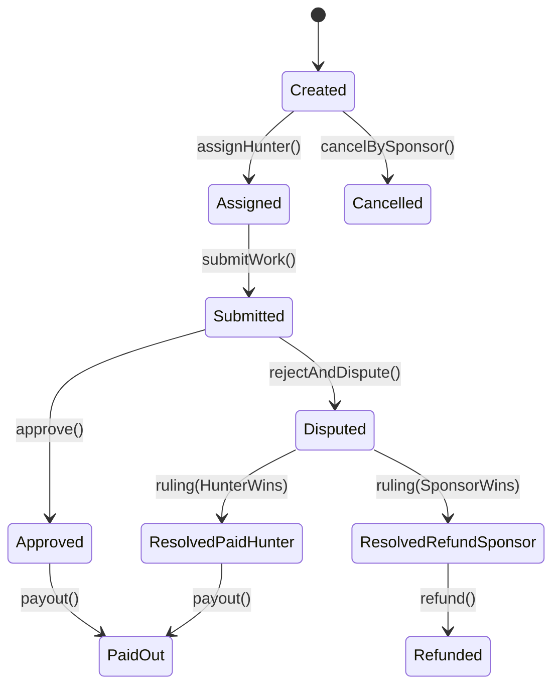

# MVP Specification: Bounty Marketplace

## Roles
- **Sponsor**: creates a bounty and deposits funds into escrow.
- **Hunter**: applies for and completes the work.
- **Arbitrator**: an external arbitration protocol (Kleros-like) that issues a `ruling` in case of a dispute.

## Sources of Truth
- **On-chain**: deposit, selected token, amounts, critical statuses, dispute/resolution, payout.
- **Off-chain**: search/filters/tags, extended metadata, notifications, inbox, profiles.

## Bounty States (state machine)
State is stored on-chain and indexed off-chain.

### Invariants
- **Deposit**: created only once and does not change after `createBounty` (no top-ups in MVP).
- **Payment**: occurs only from escrow, only once (idempotency).
- **Tokens**: ETH or whitelisted ERC20.
- **Hunter Assignment**: in MVP, the sponsor selects a hunter from the applications.
- **Dispute**: only possible from the `Submitted` state.

## Bounty Metadata (off-chain JSON)
On-chain, `metadataURI` + `metadataHash` (keccak256 of bytes JSON or canonicalized JSON) are stored.
Schema: `packages/shared/src/metadata/bounty.schema.json`.

### Minimum Fields (MVP)
- `title`: string
- `description`: string (markdown)
- `category`: enum (bugfix/feature/audit/design/content/other)
- `tags`: string[]
- `difficulty`: enum (easy/medium/hard)
- `payout`: { `tokenSymbol`: string, `amount`: string } (UI only, on-chain uses separate fields)
- `chainId`: number
- `createdAt`: ISO string

## Events (Indexer Logic)
The indexer listens to escrow events and populates Postgres:
- `BountyCreated`
- `ApplicationSubmitted`
- `HunterAssigned`
- `WorkSubmitted`
- `Approved`
- `Disputed`
- `Ruling`
- `PaidOut`

## Notifications (MVP)
Sources:
- on-chain events (via indexer),
- off-chain events (e.g., new application/comment).

Channels:
- **In-app inbox** (mandatory)
- **Webhook** (optional, but included in MVP)
- **Email** (minimal implementation via SMTP, can be disabled)
